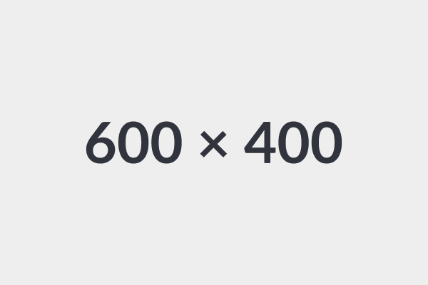

# Render hooks

## Blockquotes

> Quote

> Most human beings have an almost infinite capacity for taking things for granted.
{author="Aldous Huxley" cite="https://www.huxley.net/bnw/" caption="Brave New World"}

> [!NOTE]
> Useful information that users should know, even when skimming content.

> [!TIP]
> Helpful advice for doing things better or more easily.

> [!IMPORTANT]
> Key information users need to know to achieve their goal.

> [!CAUTION]
> Advises about risks or negative outcomes of certain actions.

> [!WARNING]
> Urgent info that needs immediate user attention to avoid problems.

## Code blocks

```bash
declare a=1
echo "$a"
exit
```

## Images

### Inline

This is an inline  image.

### Block


## Links

This is a [link](/).

This is an [external link](https://github.com/).

## Tables

| Month    | Amount |
| :------- | -----: |
| January  | $10    |
| February | $100   |
| March    | $1000  |

# Shortcodes

## accordion


  
    Lorem ipsum dolor sit amet.
  
  
    Lorem ipsum dolor sit amet.
  


## alert


  **Success:** This is a success alert.



  **Warning:** This is a small warning alert.



  This alert doesn't have an icon.


## blockquote


  Most human beings have an almost infinite capacity for taking things for granted.


## button


  Button



  Primary Small



  Primary



  Primary Large



  Secondary



  Disabled


## collapse


  ```
  1
  2
  3
  4
  5
  6
  7
  8
  9
  10
  ```




Lorem ipsum dolor sit amet, consectetur adipiscing elit, sed do eiusmod tempor
incididunt ut labore et dolore magna aliqua. Ut enim ad minim veniam, quis
nostrud exercitation ullamco laboris nisi ut aliquip ex ea commodo consequat.
Duis aute irure dolor in reprehenderit in voluptate velit esse cillum dolore eu
fugiat nulla pariatur. Excepteur sint occaecat cupidatat non proident, sunt in
culpa qui officia deserunt mollit anim id est laborum.



## details


  Lorem ipsum dolor sit amet.


## file-list


- [Page 1](#page-1)
- [Page 2](#page-2)
- [Page 3](#page-3)


## icon







## ifparam

The `title` param  set

## img





## include



## labeled-highlight


[
  {
    "name": "John",
    "age": 30
  }
]



```yaml {lineNos=true}
- name: John
  age: 30
```


## param

The page title is ""

The page description is 

## resource



```javascript {lineNos=false}
{}
```

## siteparam



## tabpane


  
    This is content for **tab 1**
  
  
    This is content for **tab 2**
  
  
    This is content for **tab 3**
  

